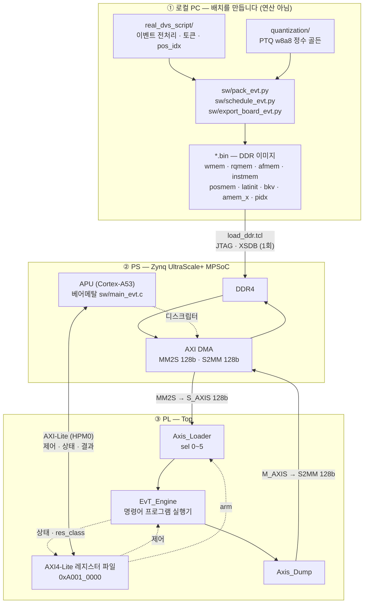
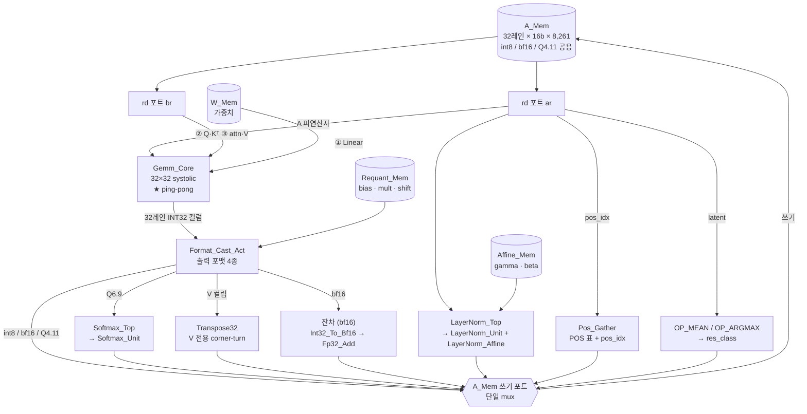
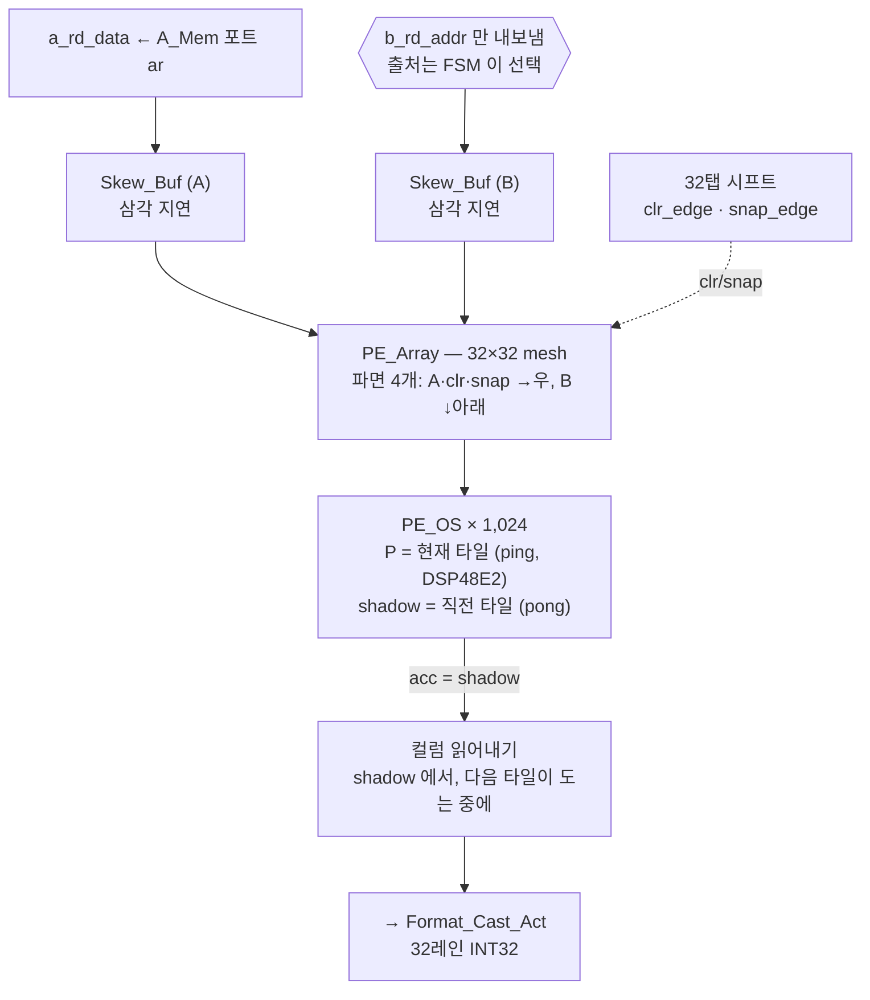
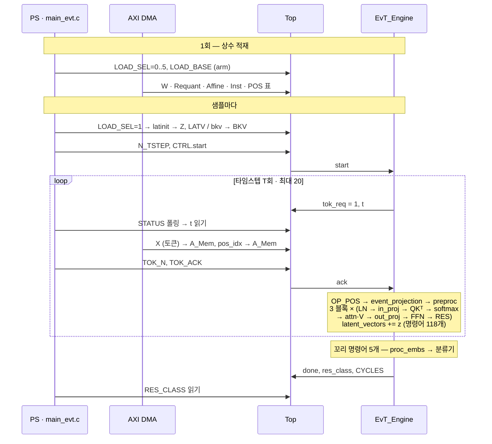

# fpga_dvs128_10 — 구조와 데이터 흐름

DVS128 제스처 인식용 **EvT(Event Transformer)** 가속기입니다. attention 을 포함한
네트워크 전체가 ZCU102 의 PL 에 올라가 있고, PS 는 데이터를 넣고 결과를 받는 역할만
합니다.

이 문서는 **무엇이 무엇에 연결되는지**와 **데이터가 어디를 거쳐 가는지**만 다룹니다.
설계 근거·검증 결과·버그 이력은 [`README.md`](README.md) 에 있습니다.

| | |
|---|---|
| 보드 | ZCU102 (xczu9eg), PL 100 MHz |
| 정확도 | **258/264 = 97.72 %** (골든 97.34 %) |
| 속도 | 샘플당 **16.8 ms**, 264 샘플 **4.43 초** |
| 엔진 사이클 | 1,662,996 / 샘플 (20 타임스텝) |
| 자원 | DSP 1,617 · BRAM 655.5 · WNS +0.094 ns |

---

## 0. 그림 파일

| 파일 | 내용 |
|---|---|
| [`docs/evt_arch.png`](docs/evt_arch.png) | 전체 — 로컬 PC → DDR → PS → AXI → `Top` → `EvT_Engine` 데이터패스 |
| [`docs/evt_gemm_pingpong.png`](docs/evt_gemm_pingpong.png) | `Gemm_Core` 내부 — systolic 배열과 ping-pong 누산기 |

아래 mermaid 그림과 같은 내용이고, PNG 쪽이 주소·포맷까지 더 자세합니다.
재생성은 [§12](#12-그림-재생성) 참고.

---

## 1. 한눈에 — 전체 데이터 흐름



**두 채널의 역할이 완전히 갈립니다.**

| | 무엇이 오가나 |
|---|---|
| **AXI4-Lite** (HPM0, 32b) | `start` · `LOAD_SEL/BASE` · `N_TSTEP` · `TOK_N/TOK_ACK` ↔ `STATUS`(done·busy·**tok_req**·t) · `RES_CLASS` |
| **AXI-Stream** (DMA, 128b) | 가중치·활성값·명령어 프로그램 적재(MM2S), A_Mem 덤프(S2MM) |

---

## 2. RTL 파일 지도

`rtl/` 을 열면 **절반이 심볼릭 링크**입니다. 이게 이 프로젝트의 구성 원칙입니다 —
비선형 유닛과 공용 산술은 별도 리포에서 개발·검증하고 링크로 끌어옵니다.

모듈명·파일명은 **PascalCase_Snake** 로 통일돼 있고, 파일 하나에 모듈 하나입니다
(`rtl/NAMING.md` §6). 디렉토리는 역할별입니다.

| 디렉토리 | 파일 |
|---|---|
| `rtl/` | `Top.v` — 보드 최상위 |
| `rtl/core/` | `EvT_Engine.v` `Format_Cast_Act.v` `Pos_Gather.v` `Transpose32.v` `Bram_Sdp.v` |
| `rtl/gemm_core/` | `Gemm_Core.v` `PE_Array.v` `PE_OS.v` `Skew_Buf.v` |
| `rtl/axi/` | `Axis_Loader.v` `Axis_Dump.v` |
| `rtl/layernorm/` | `LayerNorm_Top.v`(래퍼) `LayerNorm_Unit.v`(코어) `Rsqrt_Unit.v` `LayerNorm_Affine.v` `Rsqrt_Lut.vh` |
| `rtl/softmax/` | `Softmax_Top.v`(래퍼) `Softmax_Unit.v`(코어) `Exp2_Unit.v` `Recip_Unit.v` `Exp2_Lut.vh` `Recip_Lut.vh` |
| `rtl/gelu/` | `Gelu_Pwl.v` `Gelu_Lut.vh` |
| `rtl/requant/` | `Requant_Int.v` `Requant_Bf16.v` |
| `rtl/vector_alu/` | `Bf16_To_Fix.v` `Q411_To_Fix.v` `Int32_To_Bf16.v` `Fp32_Add.v` `Fp32_To_Bf16.v` |
| `rtl/activation/` | `Activation.v` |

### 계층

```
Top                        보드 최상위 (AXI-Lite + AXI-Stream)
├── Axis_Loader                  DMA → 온칩 메모리 6종
├── Axis_Dump                    A_Mem → DMA
└── EvT_Engine                   명령어 프로그램 실행기
    ├── Bram_Sdp × 6             Inst_Mem / W_Mem / A_Mem×2 / Requant_Mem / Affine_Mem
    ├── Gemm_Core                32×32 systolic GEMM
    │   ├── Skew_Buf × 2         A/B 삼각 지연
    │   └── PE_Array           ★ ping-pong mesh
    │       └── PE_OS × 1024     DSP48E2 + shadow
    ├── Format_Cast_Act          컬럼 → 출력 포맷 4종
    │   ├── Activation · Requant_Int · Requant_Bf16
    │   └── Gelu_Pwl
    ├── LayerNorm_Top ──► LayerNorm_Unit · Rsqrt_Unit · Bf16_To_Fix · LayerNorm_Affine
    ├── Softmax_Top   ──► Softmax_Unit · Exp2_Unit · Recip_Unit
    ├── Transpose32              V 전용 corner-turn
    ├── Pos_Gather               pos enc 온칩 게더
    └── Int32_To_Bf16 · Fp32_Add · Fp32_To_Bf16    잔차 경로
```

---

## 3. ① 로컬 PC — 연산이 아니라 *배치*를 만듭니다

호스트 스크립트는 값을 계산하지 않습니다. **스트림 바이트 순서가 곧 메모리 이미지**라,
RTL 에 재배치 회로가 하나도 없는 대신 파이썬이 전부 미리 펴 둡니다.

### 3.0 입력은 두 갈래입니다

| 원본 | 무엇 | 만든 곳 |
|---|---|---|
| `quantization/fpga_export/DVS128_10/` | **가중치·bias·곱수·gamma/beta·pos 표·latent 초기값** — 전부 이미 양자화된 정수 | `export_fpga.py` (PTQ w8a8) |
| `real_dvs_script/data/` | **이벤트 토큰·pos_idx·인덱스·라벨** | `preprocess.py` |

`pack_evt.py` 는 **양자화를 다시 하지 않습니다.** 상수를 새로 계산하면 골든과 어긋날
여지가 생기므로 `manifest.json` 을 읽어 **재배치만** 합니다.

| 스크립트 | 읽는 것 | 만드는 것 |
|---|---|---|
| `sw/pack_evt.py` | `fpga_export/*.bin` + `manifest.json` | `wmem.bin` `rqmem.bin` `afmem.bin` `posenc.int8.bin` `posmem.bin` `latinit.bin` `bkv.bin` |
| `sw/schedule_evt.py` | 위 + manifest | `instmem.bin` — 주소 계획 + 명령어 123개 |
| `sw/export_board_evt.py` | `real_dvs_script/data/*` + `posenc.int8.bin` | `amem_x.int16.bin` `amem_pidx.int16.bin` `board_index/samples.int32.bin` |

> `pack_evt.py` 를 다시 돌리면 Requant_Mem 베이스가 밀리므로 **`schedule_evt.py` 도 반드시**
> 다시 돌려야 합니다.

### 3.1 규칙은 하나입니다 — "워드 = 32레인"

온칩 메모리의 한 워드는 **PE 배열의 32레인**입니다. 그래서 모든 변환이 같은 모양입니다:

```
행렬 X[행][열]  →  워드 = 열(reduce 축),  레인 = 행(non-reduce 축)
```

이게 곧 축 전환(전치)입니다. 아래 예시는 전부 `data/` 의 실제 파일과 대조해 확인한
것입니다.

---

### 예시 ① 가중치 → `wmem.bin`

**원본**: `backbone.event_projection.seq_init.0.W.int8.bin`
— `manifest.json` 의 `shape = [96, 144]`, 즉 `w[출력채널 96][입력채널 144]` int8, 13,824 B.

```
w[0][0:8]  = [-49, -93,  21,  -8, -92, -69,  21,  -5]
w[1][0:8]  = [  3,  96,  -5,  27,  -7, 127,  25,  38]
w[31][0:8] = [-53,  67, -93, -32,-107,  28, -81, -83]
```

**규칙**: `W_Mem[w_base + nt*K + k] 레인 j = w[nt*32+j][k]` (`nt` = 출력채널 타일)

워드 0 은 `nt=0, k=0` 이므로 **레인 j = `w[j][0]`** — 즉 `w` 의 **0번 열**입니다:

```python
[w[0][0], w[1][0], w[2][0], ..., w[31][0]]
 = [-49, 3, -23, 24, -46, -7, 5, 34, -20, -21, -48, -5, -16, -9, 22, 42,
    -28, -109, -34, -11, -18, -65, -17, -39, 5, 48, 0, -76, 50, 99, -61, -53]
```

`wmem.bin` 의 첫 32 바이트가 정확히 이 값입니다. 워드 1 은 `k=1` 이므로 `w` 의 1번 열.

```
레이어 하나가 차지하는 워드 = ceil(96/32) * 144 = 3 * 144 = 432 워드
전체                        = Σ ceil(Eo/32)*Ei = 14,000 워드 x 32 B = 448,000 B
```

> **왜 전치하나** — GEMM 은 `Σ_k A[m][k]·w[n][k]` 를 돕니다. reduce 축이 `k` 이므로
> 한 사이클에 "모든 출력채널의 같은 `k`" 가 필요합니다. 그게 `w` 의 **열**입니다.

---

### 예시 ② 이벤트 토큰 → `amem_x.int16.bin`

**원본**: `real_dvs_script/data/tokens.int8.bin` — 전체 데이터셋의 토큰을 한 줄로
이어 붙인 `(236457, 144)` int8. 어디부터 어디까지가 어느 타임스텝인지는 인덱스가 말합니다:

| 파일 | 모양 | 내용 |
|---|---|---|
| `tokens.int8.bin` | (236,457, 144) int8 | 토큰 본체 |
| `index.int32.bin` | (5,182, 4) | 타임스텝마다 `(토큰 offset, n_tok, …)` |
| `samples.int32.bin` | (264, 4) | 샘플마다 `(index offset, T, …)` |
| `pos_idx.int16.bin` | (236,457,) | 토큰마다 pos 표의 행 번호 |

**샘플 0 · 타임스텝 0** 을 따라가면:

```
samples[0] = (0, 20, …)        → index 0 부터 20 타임스텝
index[0]   = (0, 52, …)        → 토큰 0 부터 52개  ← n_tok = 52
rows = tokens[0:52]            → (52, 144) int8
```

**규칙**: `A_Mem[X_base + mt*144 + k] 레인 i = rows[mt*32+i][k]`

`n_tok=52` 는 32 로 안 나눠떨어지므로 **타일 2개**(0~31, 32~51)이고, 두 번째 타일의
레인 20~31 은 유효 토큰이 없어 **0** 입니다:

```
워드 144 (타일 1, k=0) = [0, 0, 0, 23, 0, 0, 0, 36, 23, 0, 0, 0, 0, 0, 0, 0,
                          0, 0, 0, 0,  0, 0, 0,  0,  0, 0, 0, 0, 0, 0, 0, 0]
                          └─ 토큰 32~51 (20개) ─┘ └── 없음 → 0 ──┘
```

이 타임스텝이 쓰는 자리는 `2 타일 x 144 = 288 워드`입니다. `board_index[0]` 이
`(x_off=0, x_words=288, pidx_off=0, pidx_words=2, n_tok=52, -)` 로 그대로 말해 줍니다 —
PS 가 이걸 읽고 DMA 길이를 정합니다.

> **왜 int8 인데 int16 파일인가** — A_Mem 은 워드당 32레인 x **16b** 입니다
> (int8 / bf16 / Q4.11 공용). int8 값도 16b 자리에 부호확장해 담습니다.

> **왜 타임스텝마다 보내나** — 20 타임스텝을 다 넣으면 24k 워드로 A_Mem(8,261 워드)을
> 넘습니다. 그래서 한 타임스텝분만 올리고 `tok_req` 로 다음 것을 요청합니다.

---

### 예시 ③ bias·재양자화 곱수 → `rqmem.bin`

**원본**: 레이어마다 `*.B.int32.bin`(bias, int32)과 `*.M.int32.bin`(곱수, int32),
각각 출력채널 수만큼.

```
event_projection : ch0 (M,b) = (1035702804, -1026)
                   ch1        = ( 675400626, -3436)
                   ch2        = ( 541686096, -5266)
                   ch3        = (1069526574,   -94)
```

**규칙**: 채널마다 `{mult 4B, bias 4B}` = 8 B, **4채널/워드**(32 B), 리틀엔디언.

```
rqmem.bin 워드0 = 1492bb3d feffffff  b2cb4128 94f2ffff
                  └M[0]─┘ └b[0]──┘  └M[1]─┘ └b[1]──┘  … ch2, ch3
```

**레이어 채널 뒤에 한 칸이 더 붙습니다.** 엔진이 명령어 시작(`ST_CONST`)에 `RQ_BASE + NOUT`
을 한 번 읽는데, 레이어를 빈틈없이 붙이면 그 자리가 **다음 레이어의 채널 0** 이 됩니다.
통합 TB 에서 결과가 −128 로 포화해 드러난 실제 버그라, 모든 레이어 뒤에 한 칸씩 둡니다.
그 칸에는 GELU 뒤 int8 재양자화 곱수가 들어갑니다.

---

### 예시 ④ LayerNorm gamma/beta → `afmem.bin`

**원본**: `*.layer_norm.weight.int16.bin`(gamma, **Q1.14**), `*.bias.int16.bin`(beta, **Q4.11**).

```
proc_embs_block.layer_norm : gamma[:4] = [18059, 17570, 18025, 16826]   (Q1.14 → 약 1.10)
                             beta [:4] = [  -37,    56,   106,    60]   (Q4.11)
```

**규칙**: 특징마다 `{gamma 2B, beta 2B}` = 4 B, **8특징/워드**(32 B).

```
afmem.bin 워드0 = 8b46 dbff  a244 3800  6946 6a00  ba41 3c00 …
                  └γ0┘ └β0┘  └γ1┘ └β1┘  └γ2┘ └β2┘  └γ3┘ └β3┘
```

> LayerNorm 만 메모리를 **둘** 씁니다 — Affine_Mem(gamma/beta, 특징별)과 Requant_Mem(재양자화 스칼라 하나).

---

### 예시 ⑤ positional encoding → `posenc.int8.bin` · `posmem.bin`

여기만 **값을 손댑니다.** 나머지는 순수 재배치인데 pos 표는 격자를 옮겨야 합니다.

**원본**: `pos_encoding` 표 `(21, 21, 64)` int8, 자기 scale `0.0100732`.

문제는 A_Mem 한 행이 `preproc` 의 입력 벡터 160 개 전부(= projection 96 + pos 64)이고,
**GEMM 은 입력 scale 이 하나**라는 것입니다. 골든도 `cat([gelu_out, pos_embs])` 를 통째로
`preproc` 의 입력 scale 로 양자화합니다. 그래서 소비자 격자로 옮겨 담습니다:

```
code_hw = round(code_tbl * 0.0100732 / 0.0847092)      비율 0.1189

tbl[0][0][:6] = [-1, -8, 54, 44, 90, 80]      원본 코드
pos[0][0][:6] = [ 0, -1,  6,  5, 11, 10]      재양자화 후   (전체 범위 -15~14)
```

> 이걸 빠뜨리면 pos 64 워드가 통째로 **8배** 크게 들어가 통합 TB 에서 PIN 의 뒤쪽
> 64 워드가 전부 틀립니다 (앞쪽 96 워드는 맞으므로 바로 짚힙니다).

**규칙**: `posmem.bin` 은 **행 단위로 넓게** — 한 행 = `pos_idx` 하나 = 64 특징 = **64 B**.

```
441 행 (= 21x21) x 64 B = 27.6 KB      행 0 = 00 ff 06 05 0b 0a 0c 0a …
```

이 형태라 `Pos_Gather` 가 **한 번의 읽기로 한 토큰의 64 값 전부**를 얻습니다.
레인마다 다른 주소(32포트 게더)가 필요 없어집니다.

**호스트가 보내는 것은 `pos_idx` 뿐입니다** — `amem_pidx.int16.bin`, 워드 `mt` 의
레인 `i` = 토큰 `mt*32+i` 의 표 행 번호:

```
pos_idx[0:8]        = [175, 217, 238, 176, 197, 218, 177, 198]
amem_pidx 워드0[0:8] = [175, 217, 238, 176, 197, 218, 177, 198]
```

> 전에는 호스트가 타임스텝마다 pos enc 를 펴서 보냈고 그 이미지가 **96.7 MB** 였습니다.
> 표 27.6 KB + pos_idx 0.5 MB 로 끝나는 정보를 200 배 펼쳐 보낸 셈이었습니다.

---

### 예시 ⑥ latent 초기값 → `latinit.bin` (여기만 bf16)

**원본**: `backbone.memory_vertical.int16.bin` `(96, 128)` int16, `frac_bits = 15`.

```
코드  lat_i[0][:4] = [6035, 8863, 11361, 6193]
실수  x 2^-15      = [0.18417, 0.27048, 0.34671, 0.18900]
```

잔차 스트림이 bf16 이라 **정수 코드가 아니라 bf16 비트패턴**으로 담습니다:

```
워드 0 = k=0, 레인 j = latent 행 j 의 특징 0
       = [0x3e3d, 0xbdbc, 0xbc52, 0x3bae, 0x3d2c, 0xbd23, …]
         └ bf16(0.18417)
```

`Z`(inp_q)와 `LATV`(latent_vectors) **두 영역에 같은 이미지**를 넣습니다 —
`EvT.forward` 가 둘 다 이 값으로 시작하기 때문입니다.

---

### 예시 ⑦ attention 의 추가 키/값 토큰 → `bkv.bin`

attention 에는 학습된 **추가 키/값 토큰 1개**(`bias_k`, `bias_v`)가 붙습니다. 이게
`Lk = n_tok + 1` 의 `+1` 입니다.

**원본**: 블록마다 `attention.bias_k.int8.bin`, `bias_v.int8.bin` — 각각 128 = 4 head × 32.

**규칙**: `[블록 3][k, v][head 4]` 순서, **레인 = head_dim(32)**. 3×2×4 = **24 워드**.

```
워드 0  = 블록0 bias_k head0 = [-8, -3, 4, 6, 2, 1, -2, -2, …]   ← 원본 v[0:32]
워드 4  = 블록0 bias_v head0 = [-1,  4, -1, -1, 3, 3, 0, -4, …]
워드 8  = 블록1 bias_k head0
```

head 마다 워드 하나인 이유는 attention 이 **head-major** 로 저장되기 때문입니다
(§8 참고). K 영역의 head `h` 끝에 이 워드 하나가 예약 칸으로 들어가 `Lk` 번째 키가
됩니다. 샘플마다 A_Mem 의 `BKV` 영역(워드 6,728)에 DMA 합니다.

> A_Mem 은 워드당 32레인 × 16b 라 int8 값도 2 B 씩 담깁니다 — 24 워드 × 64 B = 1,536 B.

---

### 예시 ⑧ 실행 스케줄 → `instmem.bin`

`schedule_evt.py` 가 **주소 계획과 실행 순서를 먼저 확정**하고 그걸 256b 워드로 굽습니다.
RTL 은 이 표를 실행만 합니다.

**A_Mem 주소 계획** (`n_tok=123` 최악치, `schedule.json` 의 `regions`):

| 영역 | base | words | 내용 |
|---|---|---|---|
| `X` | 0 | 576 | 입력 토큰 int8 (호스트) |
| `PIDX` | 576 | 4 | pos_idx (호스트) → `Pos_Gather` 입력 |
| `PIN` | 580 | 640 | preproc 입력 = [projection 96 \| pos enc 64] |
| `PRE` | 1,220 | 512 | preproc 출력 int8 |
| `EV1` | 1,732 | 512 | proc_events.1 출력 int8(ReLU) |
| `EV` | 2,244 | 512 | proc_events 최종 (+x) int8 → K/V 원본 |
| `LATV` | 2,756 | 384 | latent_vectors 누적 bf16 |
| `Z` | 3,140 | 384 | 현재 z bf16 |
| `ZATT` | 3,524 | 384 | z_att = attn 출력 + z_input bf16 |
| `LNX` / `LN1` / `LNA` | 3,908 / 4,420 / 4,804 | 512 / 384 / 384 | LayerNorm 출력 int8 |
| `Q` / `K` / `V` | 5,188 / 5,572 / 6,212 | 384 / 640 / 516 | head-major int8 (V 는 Transpose32 출력) |
| `BKV` | 6,728 | 24 | bias_k/bias_v |
| `SM` | 6,752 | 129 | softmax 출력 uint8 |
| `CTX` | 6,881 | 384 | attn·V 결과 int8 |
| `FFN` | 7,265 | 384 | 블록 내 FFN 중간 int8 |
| **합계** | | **7,649** | A_Mem 8,261 워드 이내 |

**명령어 워드 인코딩** — 8 × 32b = 256b, 리틀엔디언:

```
w0  KIND[3:0] FMT[5:4] ACT[7:6] VAR[11:8] FLAG[15:12] SHIFT[21:16] SHIFT2[27:22] FLAG2[31:28]
w1  M      w2  K      w3  NOUT
w4  AIN    w5  BIN    w6  AOUT
w7  RQ_BASE[15:0] | OSTR[31:16]
```

**명령어 0 — `pos_gather`** (`instmem.bin` 을 디코드한 실제 값):

```
w0 = 0x00000106
     KIND=6(POS)  FMT=0  ACT=0  VAR=0b0001  FLAG=0  SHIFT=0  SHIFT2=0  FLAG2=0
M=123  K=64  NOUT=64   AIN=576(PIDX)  AOUT=580(PIN)  OSTR=160
```

`VAR[0]=1` 이므로 **`M` 은 발행 시점에 `n_tok` 으로 덮어써집니다.** 파일의 123 은
최악치 자리표시이고 실제로는 52·49·46… 이 들어갑니다.

**명령어 1 — `event_projection`**:

```
w0 = 0x09a10110
     KIND=0(GEMM)  FMT=1(Q4.11→GELU→int8)  VAR=0b0001  SHIFT=33  SHIFT2=38
M=123  K=144  NOUT=96   AIN=0(X)  BIN=0(W_Mem)  AOUT=580(PIN)  OSTR=160
```

`AOUT=580, OSTR=160` 이라 `PIN[mt*160 + n]` 에 씁니다 — **앞 96 워드가 projection
출력**이고 뒤 64 워드는 `pos_gather` 가 이미 채운 자리입니다. 이 stride 160 이
"projection 96 + pos 64" 를 한 벡터로 잇는 장치입니다.

```
instmem.bin = 3,936 B / 32 = 123 워드   (본체 118 + 꼬리 5)
```

> **stride 를 최악치로 고정한 이유** — 영역 크기를 `n_tok` 에 맞추면 베이스가 매번
> 달라져 프로그램을 5,182 벌 만들어야 합니다. 최악치로 고정하면 베이스가 전부 상수가
> 되고 `VAR` 이 네 필드만 채웁니다.

---

### 3.2 인덱스 파일 — PS 가 DMA 길이를 정하는 근거

토큰 이미지는 타임스텝마다 길이가 다릅니다. PS 가 그걸 알아야 DMA 를 걸 수 있으므로
**오프셋 표**를 같이 보냅니다.

**`board_samples.int32.bin`** — 샘플마다 4워드 `(index 시작, T, label, -)`:

```
샘플0 = (  0, 20, 9, 0)      index 0..19 가 이 샘플의 20 타임스텝, 정답 9
샘플1 = ( 20, 20, 5, 0)
샘플2 = ( 40, 20, 2, 0)
```

**`board_index.int32.bin`** — 타임스텝마다 6워드
`(x_off, x_words, pidx_off, pidx_words, n_tok, -)`:

```
t0 = (   0, 288, 0, 2, 52, 0)     ← n_tok=52 → 타일 2개 x 144 = 288 워드
t1 = ( 288, 288, 2, 2, 49, 0)
t5 = (1440, 144, 10, 1, 24, 0)    ← n_tok=24 → 타일 1개 x 144 = 144 워드
```

PS 는 이걸 그대로 DMA 길이로 씁니다 (**A_Mem 워드 = 512b = 64 B**):

```
t0 : X    0x2000_0000 + 0*64      288 워드 x 64 B = 18,432 B  → A_Mem X_BASE(0)
     pidx 0x3000_0000 + 0*64        2 워드 x 64 B =    128 B  → A_Mem PIDX_BASE(576)
     TOK_N = 52  →  TOK_ACK
```

`x_off` 누적이 `amem_x` 전체 1,426,464 워드와, `pidx_off` 누적이 `amem_pidx` 9,906
워드와 정확히 맞습니다.

**`amem_pidx.int16.bin`** — 워드 `mt` 의 레인 `i` = 토큰 `mt*32+i` 의 pos 표 행 번호.
n_tok=52 면 워드 2개(타일 2개)뿐이라 **타임스텝당 128 B** 입니다. 이게 예전 96.7 MB
pos 이미지를 대체한 것입니다.

**샘플 0 의 `n_tok` 20개**:

```
52 49 46 51 40 24 18 26 28 36 45 44 36 37 30 29 28 27 21 28
```

명령어 프로그램은 이 20 타임스텝 내내 **한 글자도 안 바뀝니다.** `VAR` 비트가
`M`/`NOUT`/`K`/`C` 를 발행 시점에 이 값으로 채울 뿐입니다.

---

### 3.3 `config.json` · `schedule.json` — 보드에 안 올라갑니다

이 둘은 **DDR 에 올리지 않습니다.** 호스트 스크립트와 TB 가 읽는 메타데이터입니다
(`make_bundle.sh` 는 참고용으로 같이 묶습니다).

**`config.json`** (`pack_evt.py` 가 생성) — "어느 레이어가 어느 메모리 어디에 있나":

| 키 | 내용 |
|---|---|
| `N` `E` `LATENT` `HEADS` `HEAD_DIM` `N_CLASS` `T_MAX` `TOK_MAX` | 32 / 128 / 96 / 4 / 32 / 10 / 20 / 128 |
| `words` | `{w: 14000, pb: 869, pg: 208}` — 각 메모리가 쓴 워드 수 |
| `w_base` `w_shape` | 레이어 → W_Mem 시작 워드 / `[Eo, Ei]`<br/>`event_projection: 0, [96,144]` → `preproc: 432, [128,160]` |
| `rq_base` `af_base` `attn_rq` `ln_rq` | 레이어 → Requant_Mem / Affine_Mem 시작 |
| `gelu_mult` `gelu_shift` `ln_shift` `ln_xsh` | 재양자화 상수, LayerNorm 고정소수점 창 |
| `pos_encoding` | `{shape, scale, table_scale, file, pl_table}` — 예시 ⑤ 의 비율이 여기 |
| `input_scales` `shifts` `in_proj_bands` | 격자 정보 (TB 골든 생성용) |

`schedule_evt.py` 가 이걸 읽어 주소를 정하고, `export_board_evt.py` 가 `pos_encoding`
을, `golden_insts.py` 가 격자를 씁니다.

**`schedule.json`** (`schedule_evt.py` 가 생성) — "무엇을 어떤 순서로":

| 키 | 내용 |
|---|---|
| `n_tok` `dims` | `123`, `{Lk:124, TT:4, QT:3, KT:5}` — 최악치 기준 타일 수 |
| `regions` | A_Mem 영역 표 (위 §예시 ⑧) |
| `a_words` | 7,649 — A_Mem 사용량 |
| `n_body` `n_tail` | **118 / 5** |
| `insts` `tail` | 명령어 하나하나의 dict — `instmem.bin` 의 사람이 읽는 판 |

`steps[i]` 는 인코딩 전 원본이라 디버깅에 씁니다:

```json
{"kind": 0, "name": "event_projection",
 "layer": "backbone.event_projection.seq_init.0",
 "M": 123, "K": 144, "NOUT": 96, "AIN": 0, "BIN": 0, "AOUT": 580,
 "FMT": 1, "SHIFT": 33, "SHIFT2": 38, "OSTR": 160, "VAR": 1,
 "note": "144→96, Q4.11→GELU→int8. PIN 앞쪽 96워드에 씀 (stride 160)"}
```

> `STATUS[13:6]` 이 현재 명령어 번호를 줍니다. 보드가 멈추면 그 번호로 `schedule.json`
> 의 `steps[n]` 을 찾아 **어느 레이어에서 섰는지** 바로 압니다.

---

### 3.4 DDR 에 올라가는 것과 아닌 것

| DDR 주소 | 파일 |
|---|---|
| `0x1000_0000` ~ `0x1015_0000` | `wmem` `rqmem` `afmem` `instmem` `latinit` `bkv` `posmem` |
| `0x2000_0000` | `amem_x.int16.bin` |
| `0x3000_0000` | `amem_pidx.int16.bin` |
| `0x4000_0000` / `0x4010_0000` | `board_index` / `board_samples` |
| **안 올라감** | `config.json` `schedule.json` `posenc.int8.bin`(중간 산물) `*.hex`(시뮬용) |

---

### 3.5 자체 검증이 들어 있습니다

축이 뒤집히기 쉬운 자리라 스크립트가 스스로 되읽어 대조합니다. **이게 없으면 보드에서야
드러납니다.**

| 어디 | 무엇을 |
|---|---|
| `pack_evt.py` | 무작위 `x` 로 `Σ_k x[k]·W_Mem[…][j]` 를 계산해 `x @ w[c]` 와 대조 (레이어마다 3채널) |
| `pack_evt.py` | 곱수가 0 인 채널이 있으면 **즉시 중단** — 그 채널 출력이 통째로 0 이 됩니다 |
| `export_board_evt.py` | 만든 워드에서 토큰을 되읽어 원본과 `array_equal`, pos enc·pos_idx 도 동일 |
| `schedule_evt.py` | 주소 계획 자체검증 |

### 3.6 DDR 로

`board/load_ddr.tcl` 이 JTAG(XSDB)로 §4 의 주소에 한 번 올립니다. **파일 순서가 곧
메모리 이미지**라 PS 는 `LOAD_SEL` 만 정하고 DMA 를 걸면 끝입니다.

---

## 4. ② PS — DDR 맵과 실행 흐름

`sw/main_evt.c` (베어메탈). DDR 주소 상수는 `board/load_ddr.tcl` 과 한 벌이어야 합니다.

| DDR 주소 | 내용 |
|---|---|
| `0x1000_0000` | `wmem.bin` 14,000 × 32B |
| `0x1010_0000` | `rqmem.bin` 869 |
| `0x1011_0000` | `afmem.bin` 208 |
| `0x1012_0000` | `instmem.bin` 123 × 32B |
| `0x1013_0000` | `latinit.bin` 384 × 64B |
| `0x1014_0000` | `bkv.bin` 24 × 64B |
| `0x1015_0000` | `posmem.bin` 441 × 64B → **PL BRAM** |
| `0x2000_0000` | `amem_x` (토큰) |
| `0x3000_0000` | `amem_pidx` (pos_idx) |
| `0x4000_0000` | `board_index` · `board_samples` |

```
1회      W · Requant · Affine · Inst · POS 적재
샘플마다  latinit → Z, LATV / bkv → BKV
         N_TSTEP 쓰고 CTRL.start
         T 번 반복 { STATUS.tok_req 대기 → t 읽기 → X·pos_idx DMA
                    → TOK_N 쓰기 → TOK_ACK }
         STATUS.done 대기 → RES_CLASS 읽기
```

**왜 타임스텝마다 넣나** — X/PIN 은 A_Mem 에 **한 타임스텝분만** 들어갑니다.
20 벌이면 24k 워드로 A_Mem(8,261 워드)을 넘습니다.

---

## 5. ③ AXI 두 채널

### AXI4-Lite 레지스터 맵 (`Top.v`)

| off | R/W | 이름 | 내용 |
|---|---|---|---|
| `0x000` | W | CTRL | [0] start(펄스) [1] dump(펄스) |
| `0x004` | R | STATUS | [0] done [1] busy [5:2] state [13:6] inst_ptr<br/>[14] **tok_req** [15] loader busy [16] dumping [22:17] 요청 중인 t |
| `0x008` | RW | N_BODY | 타임스텝당 명령어 수 (**118**) |
| `0x00C` | RW | N_TAIL | 끝에 한 번 도는 명령어 수 (5) |
| `0x010` | RW | N_TSTEP | 타임스텝 수 T (≤20) |
| `0x014` | RW | LOAD_SEL | 0=W 1=A 2=RQ 3=AF 4=INST 5=POS |
| `0x018` | W | LOAD_BASE | 쓰면 로더를 arm (시작 워드 주소) |
| `0x01C` | R | VERSION | `0x4556_5401` |
| `0x020` | R | CYCLES | 마지막 실행 클럭 수 |
| `0x024` | RW | EPS | LayerNorm eps (fp32 비트패턴) |
| `0x028` / `0x02C` | RW | DUMP_BASE / DUMP_LEN | A_Mem 덤프 범위 |
| `0x030` | R | WORDS_LOADED | 마지막 로드가 쓴 워드 수 (DMA 검산) |
| `0x034` | RW | TOK_N | 이번 타임스텝의 토큰 수 |
| `0x038` | W | TOK_ACK | 쓰면 ack 펄스 |
| `0x03C` | R | **RES_CLASS** | [3:0] argmax |
| `0x400+` | R | RES_LOGITS | 10 워드 (디버그) |

### AXI-Stream 적재 (`Axis_Loader.v`)

`LOAD_SEL` → `LOAD_BASE`(쓰면 arm) → DMA. `tready` 는 항상 1 (목적지가 BRAM).

| sel | 목적지 | 폭 |
|---|---|---|
| 0 | W_Mem | 256b → 2 beat/word |
| 1 | **A_Mem** | 512b → 4 beat |
| 2 | Requant_Mem | 256b → 2 beat |
| 3 | Affine_Mem | 256b → 2 beat |
| 4 | **Inst_Mem** | 256b → 2 beat |
| 5 | POS 표 (`Pos_Gather` 안) | 512b → 4 beat |

> 명령어를 DMA 목적지로 넣은 게 `fpga_nl` 과 다른 점입니다 — 123 명령어 × 8 워드를
> AXI-Lite 레지스터로 쓰면 976 번입니다.

---

## 6. ④ Top — 최상위 배선

`tcl/build.tcl` 이 만드는 BD:

```
PS ─HPM0(32b)─→ smc_ctrl ─┬─→ axi_dma_0 / S_AXI_LITE
                          └─→ evt_accel_0 / s_axi        제어 · 핸드셰이크 · 결과
PS ←─HP0(128b)─ smc_data ←┬── axi_dma_0 / M_AXI_MM2S
                          └── axi_dma_0 / M_AXI_S2MM
axi_dma_0 / M_AXIS_MM2S(128b) ──→ evt_accel_0 / s_axis    적재
axi_dma_0 / S_AXIS_S2MM(128b) ←── evt_accel_0 / m_axis    A_Mem 덤프
```

---

## 7. ⑤ EvT_Engine — 명령어 프로그램 실행기

### FSM

```
IDLE → FETCH → DEC → GCONST → RUN → WAIT → NEXT → TSTEP → TLOAD → DONE
```

`Inst_Mem` 에서 256b 명령어 워드를 하나씩 읽어 7 종 명령을 발행합니다
(타임스텝당 명령어 **118**개 + 마지막에 꼬리 **5**개):

| KIND | 하는 일 |
|---|---|
| `OP_GEMM` (0) | GEMM → Format_Cast_Act |
| `OP_LN` (1) | LayerNorm_Top |
| `OP_SMAX` (2) | Softmax_Top |
| `OP_RES` (3) | 잔차 누적 (bf16) |
| `OP_MEAN` (4) | latent 평균 |
| `OP_ARGMAX` (5) | 분류 결과 |
| `OP_POS` (6) | Pos_Gather |

### 명령어 프로그램은 **정적**입니다

`n_tok` 은 타임스텝마다 다릅니다(실측 16~123). 영역 크기를 `n_tok` 에 맞추면 베이스가
매번 바뀌어 프로그램을 5,182 벌 만들어야 합니다. 그래서 **모든 영역 stride 를
최악치(토큰 128)로 고정**했습니다. 그러면 베이스가 전부 상수가 되고, `n_tok` 에 따라
바뀌는 것은 네 필드뿐입니다 — 발행 시점에 레지스터로 채워 넣습니다:

```
VAR[0]  M    ← n_tok        (토큰 행을 도는 명령어)
VAR[1]  NOUT ← n_tok+1      (Q·Kᵀ 의 Nout = Lk)
VAR[2]  K    ← n_tok+1      (attn·V 의 reduce = Lk)
VAR[3]  C    ← n_tok+1      (softmax 의 클래스 수 = Lk)
```

### 명령어 워드 (256b)

```
[ 31: 0] KIND[3:0] FMT[5:4] ACT[7:6] VAR[11:8] FLAG[15:12]
         SHIFT[21:16] SHIFT2[27:22] FLAG2[31:28]
[ 63:32] M   [ 95:64] K   [127:96] NOUT
[159:128] AIN   [191:160] BIN   [223:192] AOUT
[255:224] RQ_BASE[15:0] | OSTR[31:16]

FLAG  [0] Transpose32 경유  [1] head-major  [2] B는 A_Mem  [3] raw16
FLAG2 [0] LN 입력이 정수 코드  [1] RES 피연산자가 정수 코드
      [2] B에 bias 토큰  [3] 활성함수 뒤 2차 재양자화
```

필드 하나가 명령어 종류에 따라 다른 뜻을 갖습니다 — 워드를 늘리는 대신 **그 명령어에서
확실히 노는 칸**을 씁니다 (QK 는 `AOUT`, AV 는 `OSTR` 이 놉니다).

### 온칩 메모리

| | 폭 × 깊이 | 크기 |
|---|---|---|
| W_Mem | 256b × 16384 | 437 KB (14,000 워드) |
| **A_Mem** | **512b × 16384, 2벌** | 478 KB 사용 |
| Requant_Mem | 256b × 1024 | 27 KB (채널 3,476) |
| Affine_Mem | 256b × 256 | 6.5 KB (LayerNorm 13개) |
| Inst_Mem | 256b × 256 | 3.9 KB (명령어 123 = 본체 118 + 꼬리 5) |

### A_Mem 이 구조의 중심입니다

**`u_amem0` / `u_amem1` 은 핑퐁이 아니라 같은 내용 2벌입니다.** 쓰기 포트를 공유하고
읽기 포트만 나뉩니다:

```
쓰기  aw_en / aw_addr / aw_data      ← 단일 mux (생산자 7종 + 로더 sel1)
읽기  ar : A 피연산자 · 덤프 · LN · Pos · MEAN
      br : B 피연산자 (GEMM 전용)
```

GEMM 만은 A 와 B 를 **동시에** 읽는데 `Q·Kᵀ`·`attn·V` 는 둘 다 A_Mem 입니다.
BRAM 이 남아서 미러링이 가장 단순했습니다.

| A_Mem 영역 | 워드 |
|---|---|
| X (토큰) | 0 |
| pos_idx | 576 |
| PIN | 580 |
| LATV | 2,756 |
| Z | 3,140 |
| BKV | 6,728 |

---

## 8. ⑥ 데이터패스



### GEMM 세 종류가 회로 **1벌**입니다

EvT 의 GEMM 은 셋인데 전부 같은 식입니다:

| | 식 | B 출처 |
|---|---|---|
| ① Linear | `C[m][n] = Σ_k A[m][k]·W[n][k]` | W_Mem |
| ② Q·Kᵀ | `C[m][n] = Σ_d Q[m][d]·K[n][d]` | **A_Mem** |
| ③ attn·V | `C[m][n] = Σ_j attn[m][j]·V[j][n]` | **A_Mem** |

시스톨릭 코어는 A·B 둘 다 **"워드 = reduce 인덱스, 레인 = non-reduce 인덱스"** 로
읽으므로 ②③도 ①과 똑같은 회로입니다:

```
A_Mem[a_base + mt*K + k] 레인 i = A[mt*32+i][k]
B    [b_base + nt*K + k] 레인 j = B[k][nt*32+j]
```

그래서 `Gemm_Core` 는 **`b_rd_addr` 만 내보내고**, 어느 메모리가 답할지는
`EvT_Engine` 이 정합니다.

**예외는 V 하나뿐입니다.** `attn·V` 는 reduce 축이 head_dim(32)에서 토큰(Lk)으로
바뀌는 유일한 자리라 B 가 "워드[j] 레인=d" 여야 하는데 `in_proj` 은 "워드[d] 레인=토큰"
을 줍니다. 그래서 `Transpose32` 가 붙습니다 — 이 모듈이 존재하는 이유의 전부입니다.

### Format_Cast_Act — 출력 포맷 4종

| consumer | 경로 | 목적지 |
|---|---|---|
| `FMT_INT8` | requant(acc+b, M, sh) → [ReLU] → int8 | A_Mem 하위 8b |
| `FMT_Q411` | requant → Q4.11 → **Gelu_Pwl** → requant → int8<br/>(`raw16=1` 이면 Q4.11 16b 그대로) | A_Mem |
| `FMT_BF16` | bf16( (acc+b)·scale[n] ) — 잔차 스트림 | A_Mem 16b |
| `FMT_Q69` | requant → Q6.9 | **Softmax_Top 직결** |

### 비선형은 래퍼로 감쌌습니다

`Softmax_Top.v` / `LayerNorm_Top.v` 가 엔진 쪽 인터페이스를 그대로 유지하면서 안쪽만
새 코어로 바꿉니다. **엔진은 바뀐 줄 모릅니다.**

| | 래퍼가 맞춰 주는 것 | 효과 |
|---|---|---|
| `Softmax_Top` | `n_col` → `in_last`, Q1.14 → uint8 (SM_MULT 16253, SH 21) | 6,800 → **151** 사이클 (Lk=53) |
| `LayerNorm_Top` | A_Mem 스트리밍, `LayerNorm_Affine`(gamma/beta), Q4.11 → int8 | 5,376 → **572** 사이클 (타일 3개) |

### Pos_Gather — pos enc 는 온칩입니다

전에는 호스트가 타임스텝마다 pos enc 를 펴서 DDR 에 올렸고 그 이미지가 **96.7 MB**
였습니다. 정보량은 표 27.6 KB + `pos_idx` 뿐이라 200 배를 펼쳐 보낸 셈입니다.

표를 **행 단위로 넓게**(한 행 = 64 특징 = 512b) 두면 한 토큰의 64 개 값이 한 번의
읽기로 나옵니다. 타일 하나(토큰 32개)에 ~160 사이클, 타임스텝당 650 사이클 남짓 —
**0.1 %** 입니다.

---

## 9. ⑦ Gemm_Core 와 ping-pong 누산기

> `PE_Array.v` / `PE_OS.v` — 이번에 추가된 부분입니다. 상세 그림은
> [`docs/evt_gemm_pingpong.png`](docs/evt_gemm_pingpong.png).



### 왜 누산기를 둘로 나눴나

누산기가 DSP48E2 의 `P` 하나뿐이라, 컬럼 32 개를 **다 뽑아낼 때까지** 다음 타일을
시작할 수 없었습니다. 타일 주기 `K+114` 중 실제 곱셈은 `K` 뿐이었습니다 (K=128 이면 53 %).

```
P       지금 타일을 누적                 (ping)
shadow  직전 타일의 최종값을 들고 있음   (pong)   ← 읽어내기는 여기서
```

### 전역 snapshot 이면 절반밖에 못 법니다

output-stationary 배열에서 PE 는 대각 wavefront 를 따라 끝납니다:

```
레인 i 가 k 를 내는 시각   = k + 1 + i          (Skew_Buf)
PE[i][j] 가 k 를 받는 시각 = k + 1 + i + j      (a_reg/b_reg 각 1홉)
P 에 반영                  = + 2                (DSP48E2 MREG+PREG)
⇒ PE[i][j] 확정 = K + i + j + 2
```

**PE 마다 끝나는 시각이 다릅니다.** snapshot 을 전역으로 걸면 가장 늦은
`PE[31][31]`(K+64)을 모두가 기다려 주기가 `K+67` 에서 멈춥니다. `clr` 과 `snap` 을
**A 와 같은 방향으로 흘리면** PE 마다 자기 시각에 걸립니다.

| 누산기 구조 | 타일 주기 | 왜 |
|---|---|---|
| 원본 `PE_OS` (P 하나) | K + 114 | 컬럼을 다 뽑을 때까지 다음 타일 불가 |
| 순수 ping-pong (전역 clr/snap) | K + 67 | `PE[31][31]` 확정을 배열 전체가 대기 |
| **★ systolic clr/snap (`PE_OS`)** | **max(K+4, 36)** | PE 마다 제 시각(K+i+j+2)에 snapshot |

**DSP48E2 인스턴스는 원본 그대로입니다** — 리셋 소스만 전역 `clr` 에서 그 PE 의
`clr_in` 으로 바뀝니다. 비용은 PE 당 shadow 32 FF + 전파 2 FF, 배열 전체 약
34.8K FF (+6.4 %p).

### 산술은 안 건드렸습니다

`tb_evt` 140,170 검사가 **원본과 한 글자도 다르지 않고**, 보드 264 샘플의 **구간별
오답 분포까지 같습니다**. 바꾼 것은 **언제 읽느냐**뿐입니다.

---

## 10. 한 샘플이 도는 순서



**`tok_req`/`tok_ack` 핸드셰이크가 핵심입니다.** 엔진이 멈춰서 요청하고, PS 가 그
타임스텝의 X/pos_idx 를 DMA 한 뒤 ack 합니다. 이 대기가 엔진 `busy` 안에 있어서
보드 사이클이 시뮬보다 **약 2 %** 큽니다 (실효 928 MB/s, 피크의 58 %).

---

## 11. 성능

| | 예전 코어 | 새 비선형 (§1.5) | **+ ping-pong (§1.6)** |
|---|---|---|---|
| 샘플당 (보드) | 108.4 ms | 24.6 ms | **16.8 ms** |
| 264 샘플 | 28.61 초 | 6.50 초 | **4.43 초** |
| 엔진 사이클 | — | 2,441,437 | **1,662,996** |
| 정확도 | 257/264 | 258/264 | **258/264** (동일) |
| 누적 | 1× | 4.40× | **6.46×** |

타임스텝 하나의 내역 (`tb_evt_prof`, n_tok=52):

```
ping-pong 전  총 129,696   GEMM 103,046 (79.5 %)  RES 17,721  LN 7,434  MEAN 903  POS 337  ARGMAX 255
ping-pong 후  총  87,717   GEMM  61,114 (−40.7 %)
```

**다음 병목은 RES 입니다.** A_Mem 은 읽기 2 포트인데 RES 는 한 포트만 시분할해 워드당
6 단(`rs_ph`)을 돕니다. 두 포트를 쓰면 1 워드/사이클이 되어 **17,721 → 약 3,000**
입니다 (미적용).

---

## 12. 그림 재생성

```sh
cd docs
dot -Tpng -Gdpi=120 evt_arch.dot          -o evt_arch.png
dot -Tpng -Gdpi=120 evt_gemm_pingpong.dot -o evt_gemm_pingpong.png
```

한글 라벨은 `Noto Sans CJK KR` 을 씁니다 (`fc-list :lang=ko` 로 확인).

---

## 부록 — 헷갈리기 쉬운 자리

| | |
|---|---|
| **A_Mem 2벌은 핑퐁이 아닙니다** | 쓰기 포트를 공유하는 **같은 내용 미러**입니다. 나뉘는 건 읽기 포트뿐 (`EvT_Engine.v:222-231`) |
| **pos enc 는 온칩입니다** | `sw/export_board_evt.py` 독스트링의 "호스트가 미리 펴서 넣습니다" 는 예전 방식입니다. 현재 경로는 `Pos_Gather` + `SEL_POS`(`sw/main_evt.c:153-160`) |
| **`Softmax_Top`/`LayerNorm_Top` 은 래퍼입니다** | 실제 연산은 `Softmax_Unit`/`LayerNorm_Unit` 코어에 있습니다 |
| **`tb_softmax_attn` 은 더는 안 맞습니다** | 예전 코어의 LUT 산술을 비트 단위로 보던 TB 입니다. 지금은 `tb_smx_wrap` / `tb_ln_wrap` |
| **`PE_Array`/`PE_OS` 는 미커밋** | 보드 264 샘플까지 확인됐으나 아직 커밋 전입니다 |
