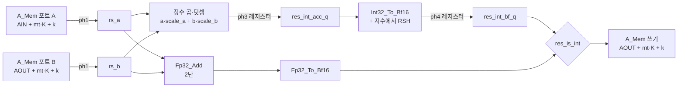

# RES(잔차 덧셈)가 사이클을 먹는 이유

> 목적 : **고치기 전에 원인을 정확히 짚기.** 아래 숫자는 코드에서 계산한 추정이고,
> 실측은 `EVT_PROF=1 ./tb/run_vcs.sh tb_evt` 로 명령어별 표를 뽑을 수 있습니다.

---

## 1. 문제 — 명령어의 6.5 %가 사이클의 18 %를 먹습니다

| 종류 | 명령어 수 | 사이클/타임스텝 | 비중 |
|---|---|---|---|
| GEMM | 99 | 63,068 | 71.4 % |
| **RES** | **8** | **16,000** | **18.1 %** |
| LayerNorm | 13 | 6,940 | 7.9 % |
| MEAN · POS · ARGMAX | 3 | 2,312 | 2.6 % |

RES 명령어 여덟 개:

| # | 이름 | M | K | 행타일 | 사이클 |
|---|---|---|---|---|---|
| 5 | `proc_ev.res` | 123 | 128 | 4 | 2,560 |
| 36 | `cross_attention.res_att` | 96 | 128 | 3 | 1,920 |
| 42 | `cross_attention.res_ffn` | 96 | 128 | 3 | 1,920 |
| 73 | `latent_attentions.0.res_att` | 96 | 128 | 3 | 1,920 |
| 79 | `latent_attentions.0.res_ffn` | 96 | 128 | 3 | 1,920 |
| 110 | `latent_attentions.1.res_att` | 96 | 128 | 3 | 1,920 |
| 116 | `latent_attentions.1.res_ffn` | 96 | 128 | 3 | 1,920 |
| 117 | `latent.acc` | 96 | 128 | 3 | 1,920 |

```
사이클 = K × 행타일 × 5
         └ 128   └ 3      └ 이 5 가 문제입니다
```

**하는 일에 비해 비쌉니다.** GEMM 은 워드 하나를 읽어 곱셈 1,024개를 돌리면서
워드당 1사이클인데, RES 는 워드 두 개를 읽어 **덧셈 32개**를 하면서 워드당 5사이클입니다.

---

## 2. 지금 도는 방식 — 순차 루프

`rs_ph` 가 0→4 를 돈 **뒤에야** `rs_k` 가 올라갑니다.
([EvT_Engine.v:996-1012](../rtl/core/EvT_Engine.v#L996-L1012))

```
        ┌─────────── 워드 k ───────────┐┌─────────── 워드 k+1 ─────────┐
rs_ph   │ 0 │ 1 │ 2 │ 3 │ 4 │          │ 0 │ 1 │ 2 │ 3 │ 4 │
        └───┴───┴───┴───┴───┘          └───┴───┴───┴───┴───┘
rs_k    ├──────── k ────────┤          ├─────── k+1 ───────┤
                            └ 여기서 +1

  ph0   A_Mem 두 포트에 주소 제시        a_ra_addr / a_rb_addr
  ph1   두 워드 도착 → 래치              rs_a <= a_ra_data,  rs_b <= a_rb_data
  ph2   덧셈기에 투입                    Fp32_Add.in_valid  /  정수 곱·덧셈
  ph3   곱·덧셈 결과 레지스터            res_int_acc_q
  ph4   정규화 끝 → A_Mem 쓰기           a_we_en = 1
```

핵심은 **이 5단이 "지연"이지 "처리율 한계"가 아니라는 것**입니다.
데이터패스는 매 사이클 새 값을 받을 수 있는데 제어가 한 번에 하나씩만 밀어 넣습니다.

### 사이클이 어디로 가나 — 하드웨어 가동률

한 워드 5사이클 동안 각 유닛이 실제로 일하는 사이클:

| 유닛 | 개수 | 일하는 사이클 | 가동률 |
|---|---|---|---|
| A_Mem 읽기 포트 A·B | 2 | 1 (ph0) | **20 %** |
| `Fp32_Add` | 32 | 2 (ph2~3) | 40 % |
| `Int32_To_Bf16` | 32 | 1 (ph3) | 20 % |
| A_Mem 쓰기 포트 | 1 | 1 (ph4) | **20 %** |

**모든 유닛이 5분의 4를 놉니다.**

---

## 3. 데이터패스 — 왜 5단이 됐나

([EvT_Engine.v:627-671 `g_res_lane`](../rtl/core/EvT_Engine.v#L627-L671) — 레인 32벌)



경로가 둘인 이유 : 보통은 bf16 두 값을 더하지만, `proc_events` 의
`x = seq_init(x) + x_input` 한 자리만 **두 피연산자가 정수 코드이고 scale 이 다릅니다**
(0.019991 vs 0.038420). 그 자리를 bf16 상수 곱으로 처리하면 비율이 0.4 % 흔들려
결과의 절반이 어긋납니다.

### 단수를 늘린 근거 (`[타이밍]` 마커)

| 자리 | 안 끊으면 한 사이클에 들어가는 것 |
|---|---|
| ph1 래치 | `A_Mem BRAM → FP 정렬 배럴시프터 → sum1` |
| ph3 레지스터 | `곱셈2 + 덧셈 → 32b LZC·정규화 → 지수` |

**둘 다 187.5 MHz 를 지키려고 넣은 것이라, 단수를 줄이는 건 답이 아닙니다.**

---

## 4. 고치는 방향 — 단수는 그대로, 처리율만 올리기

`rs_k` 를 **매 사이클** 올리고 쓰기 주소를 4단 지연시키면 됩니다.
지연은 그대로 5사이클이지만 **워드당 1사이클**이 됩니다.

```
지금 (순차)
  ph      0  1  2  3  4  0  1  2  3  4  0  1  2  3  4
  주소    k              k+1            k+2
  쓰기             k              k+1            k+2
          └─ 5사이클/워드 ─┘

파이프라인 (제안)
  cyc     0  1  2  3  4  5  6  7  8  9 10 11 …
  주소    k k+1 k+2 k+3 k+4 k+5 …          ← 매 사이클
  쓰기             k k+1 k+2 k+3 k+4 …      ← 4단 뒤, 매 사이클
          └ 1사이클/워드, 지연은 그대로 5 ┘
```

| | 지금 | 파이프라인 |
|---|---|---|
| 워드당 사이클 | 5 | **1** |
| RES 합계 / 타임스텝 | 16,000 | 약 **3,200** |
| 전체 비중 | 18.1 % | 약 **4.2 %** |
| 전체 사이클 | 88,320 | 약 **75,500** (−14 %) |

---

## 5. 걸림돌 셋 — 여기를 먼저 풀어야 합니다

### ① 쓰기 주소 파이프가 필요합니다

지금은 쓰기 주소를 `rs_k` / `rs_mt` 에서 **바로** 만듭니다
([EvT_Engine.v:829-838](../rtl/core/EvT_Engine.v#L829-L838)). 매 사이클 주소를 올리면
`rs_k` 는 이미 4칸 앞서 있으므로 **주소를 같이 지연**시켜야 합니다.

> `Format_Cast_Act` 가 `fca_n_pipe` / `fca_mt_pipe` 로 하는 것과 같은 문제입니다.
> 그쪽 구현을 그대로 가져오면 됩니다.

### ② 행타일·명령어 경계에서 파이프를 비워야 합니다

`rs_k` 가 한 바퀴 돌아 `rs_mt` 가 올라갈 때, 파이프에 앞 타일의 워드 4개가 남아 있습니다.
그대로 넘기면 **다음 타일 주소로 써집니다.**

> GEMM 이 `fca_busy` 로 푸는 것과 같은 문제입니다. `ST_WAIT` 의 종료 조건에도
> "파이프가 비었나"가 들어가야 합니다.

### ③ A_Mem 읽기·쓰기가 매 사이클 겹칩니다

지금은 읽기(ph0)와 쓰기(ph4)가 다른 사이클이라 겹치지 않습니다.
파이프라인이 되면 **매 사이클 두 포트를 읽으면서 동시에 씁니다.**

- 쓰기 포트는 미러 2벌이 공용이라 포트 자체는 남습니다 (문제 없음)
- 다만 `AOUT` 을 **읽으면서 쓰는** 자리라, 같은 주소를 같은 사이클에 만나는지
  확인해야 합니다 — 읽기는 k, 쓰기는 k−4 이므로 **k ≠ k−4 라 안 겹칩니다.**
  타일 경계에서만 확인이 필요합니다.

---

## 6. 다음 단계

1. **실측 먼저** — `EVT_PROF=1 ./tb/run_vcs.sh tb_evt` 로 명령어별 사이클 표를 뽑아
   위 추정(16,000)이 맞는지 확인
2. 파이프라인 구조를 `Format_Cast_Act` 방식으로 설계
3. 고친 뒤 회귀 로그를 **변경 전과 diff** — RES 는 결과가 바뀌면 안 됩니다
   (`rtl/NAMING.md` §8)
4. 사이클이 줄었는지는 `tb_accel_evt` 의 `done — N 사이클` 로 바로 보입니다
